# KAI in action, screenshots

Real screenshots of KAI running against a live corpus (the Apache Kafka
documentation space). Every answer below is **grounded and cited**, drawn only from
the indexed sources; an out-of-scope question **escalates instead of fabricating**.
That behaviour is enforced by the grounding/verification guards and validated by the
golden question set in [`eval/`](../eval/) plus the automated test suite (`pytest`).

> These are genuine captures from a running instance, not mockups.

## Web chat UI

The standalone, dependency-free web chat app in [`frontend/`](../frontend/), no
bot, no tokens. It calls the HTTP API over CORS; set the API base (and an API key, if
one is configured) right in the header.

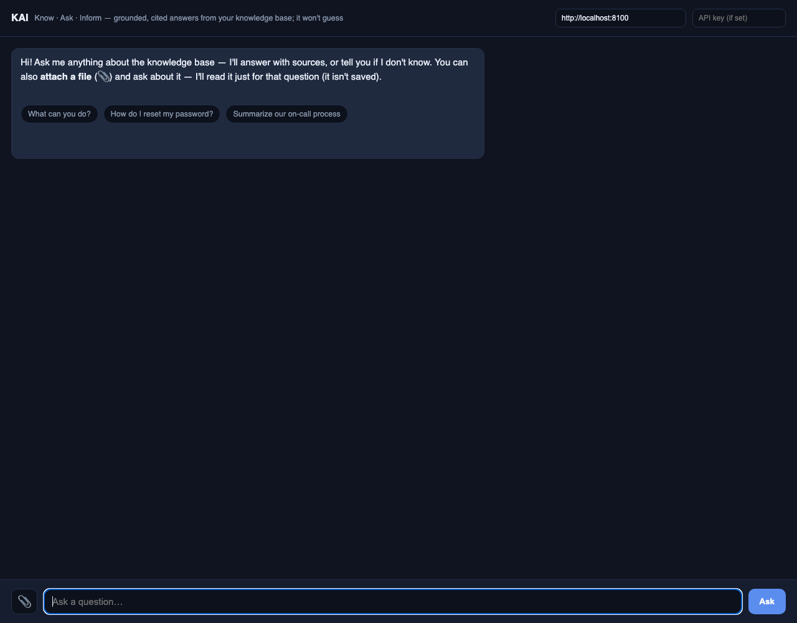

### A grounded, cited answer

The question *"How does Kafka replication work?"* answered from the indexed corpus,
with inline `[1] [2] [3]` citation markers and a clickable **Sources** list. Nothing
in the answer is ungrounded, every claim traces back to a retrieved passage.

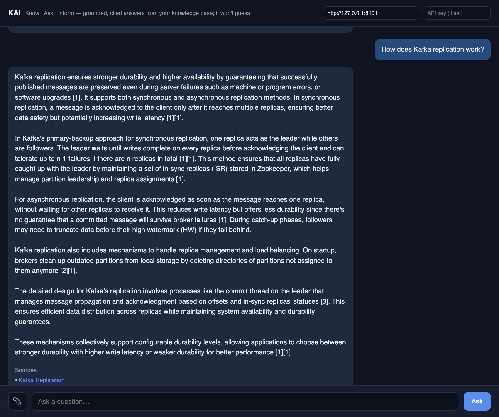

## HTTP API, OpenAPI / Swagger

The interactive API reference served at `/docs` (FastAPI/Swagger): every
endpoint, `/ask`, `/ask-document`, `/ingest`, `/admin/reindex`, `/search`,
`/feedback`, `/admin/inform`, ..., with request/response schemas and a live *try it*.

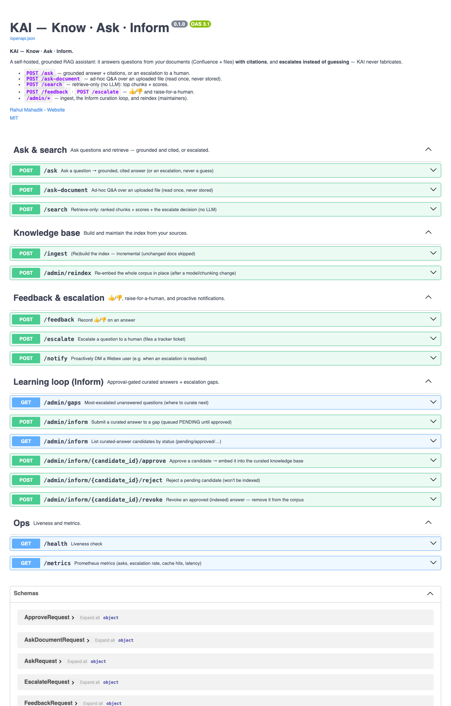

## Webex bot

The same brain behind a Webex bot (outbound websocket: no public URL). Add the bot to
a space, @mention it, and get the same cited answer or honest escalation.

Add the bot to a space:

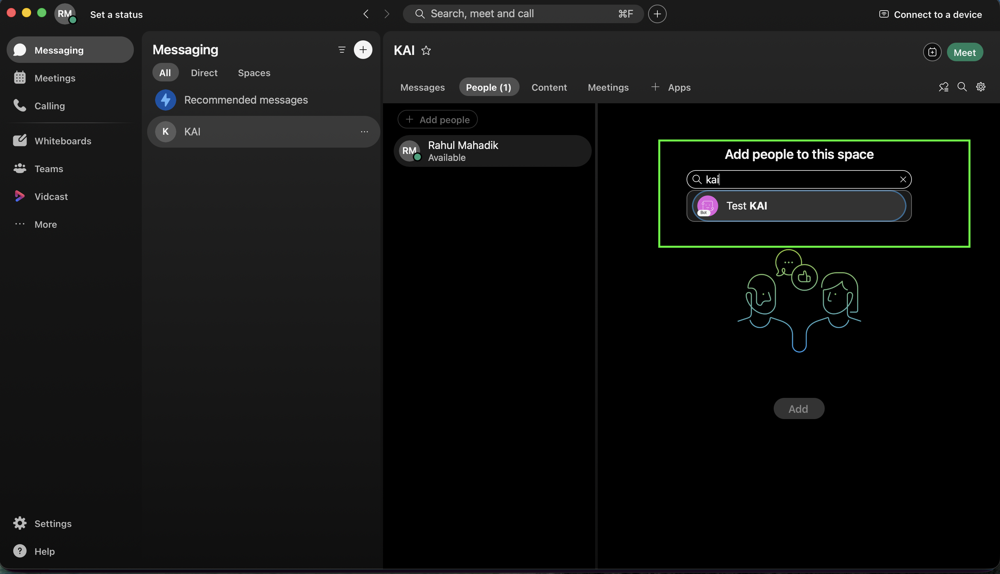

The instant "Searching..." acknowledgement, then the grounded, cited answer:

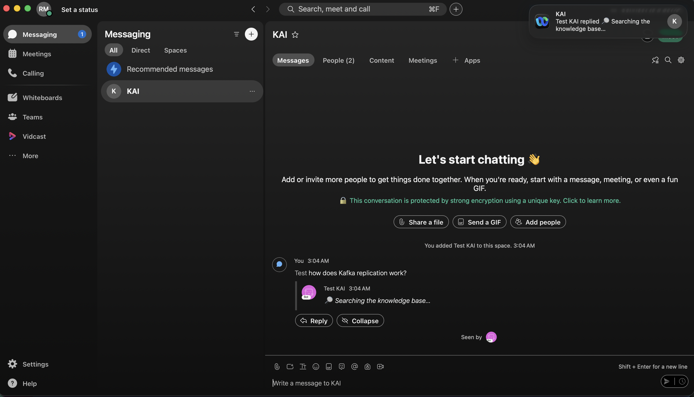

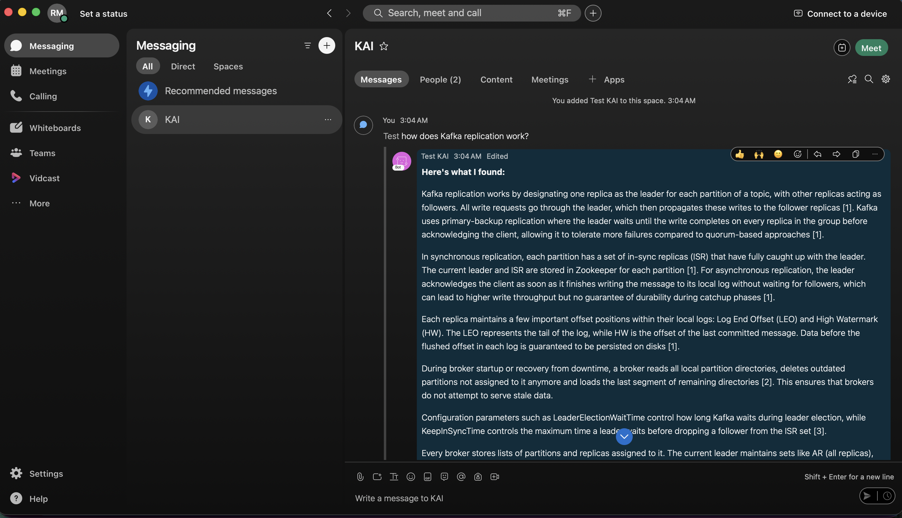

## Slack bot

KAI in Slack via **Socket Mode** (no public URL). Install the app, add it to a channel,
then @mention it (or DM it), same grounding guards and feedback card as every surface.

The KAI app in Slack, and adding it to a channel:

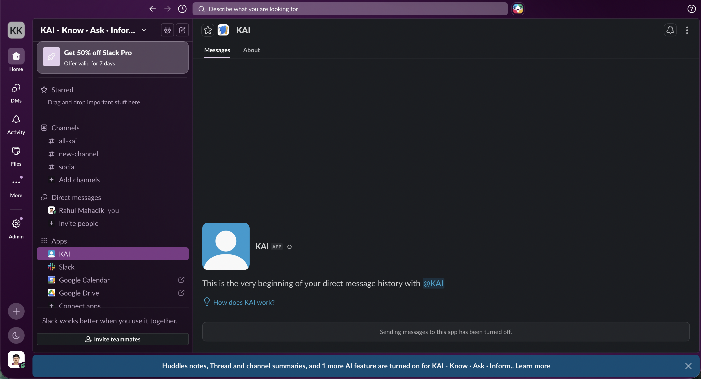

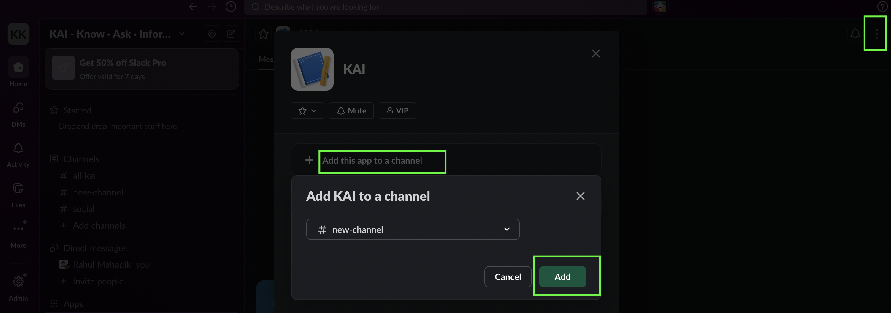

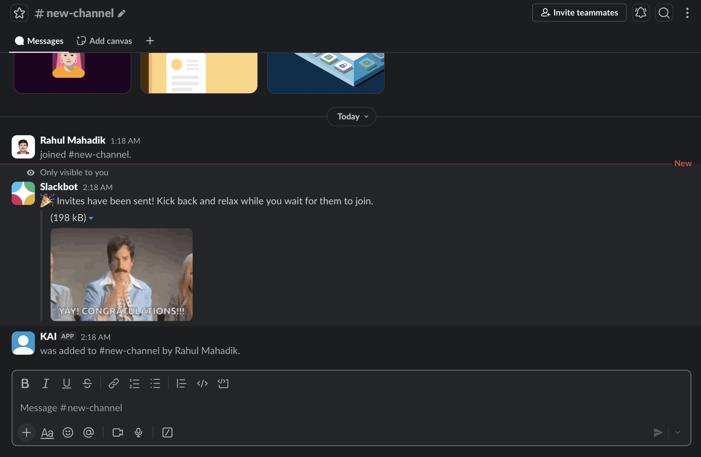

A cited answer in-thread, inline `[1] [2] [3]`, a **Sources** list, and 👍/👎/Escalate:

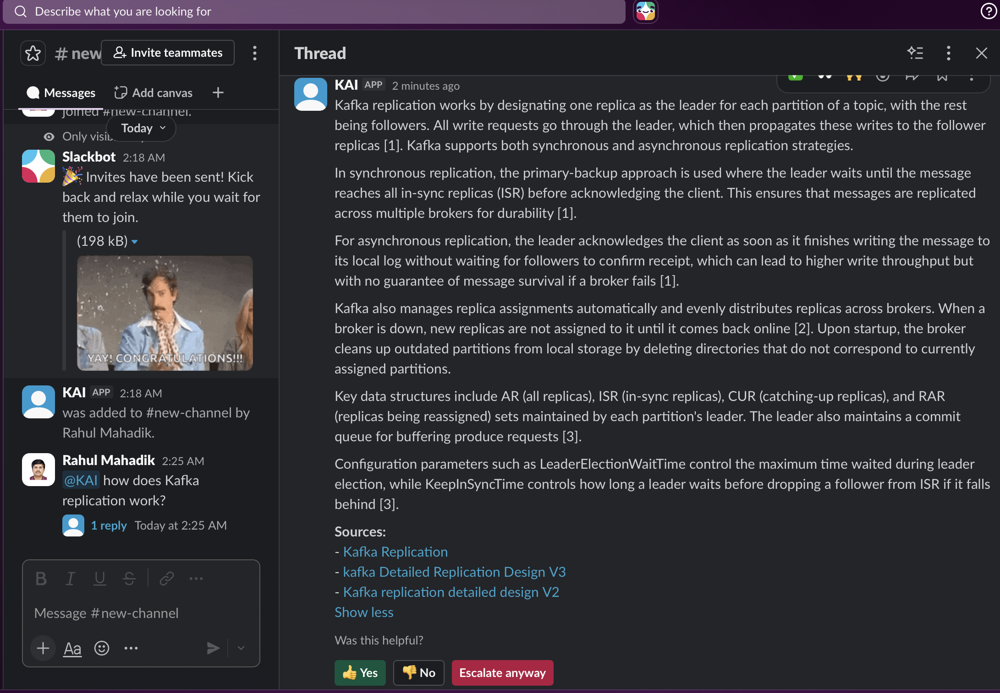

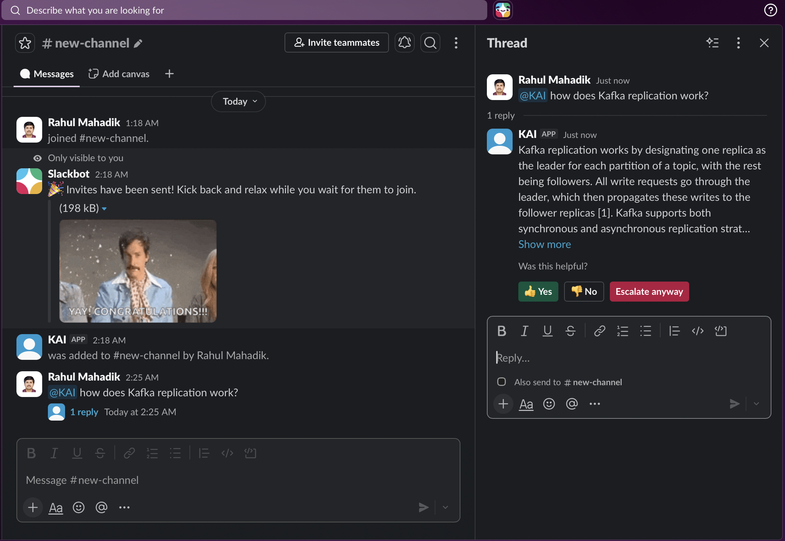

## Verified

This build is exercised end to end, not just unit-tested:

- **Automated suite:** `pytest`, 600+ tests green; `ruff` clean.
- **Live API smoke (19 scenarios):** `/health`; `/ask` (in-scope **cited**,
  out-of-scope **escalated**, fabrication-bait **escalated**, blank → `422`); `/search`;
  `/ask-document` (PDF & text **supported**, `.docx` cleanly **rejected**); `/feedback`
  (👍/👎 + invalid → `422`); `/escalate`; `/notify`; `/metrics`; `/admin/*`, all pass,
  with the never-fabricate guarantee holding in every scenario.
- **Golden eval:** `python eval/run_eval.py` against a curated question set.

The screenshots above are genuine captures from a running instance.

